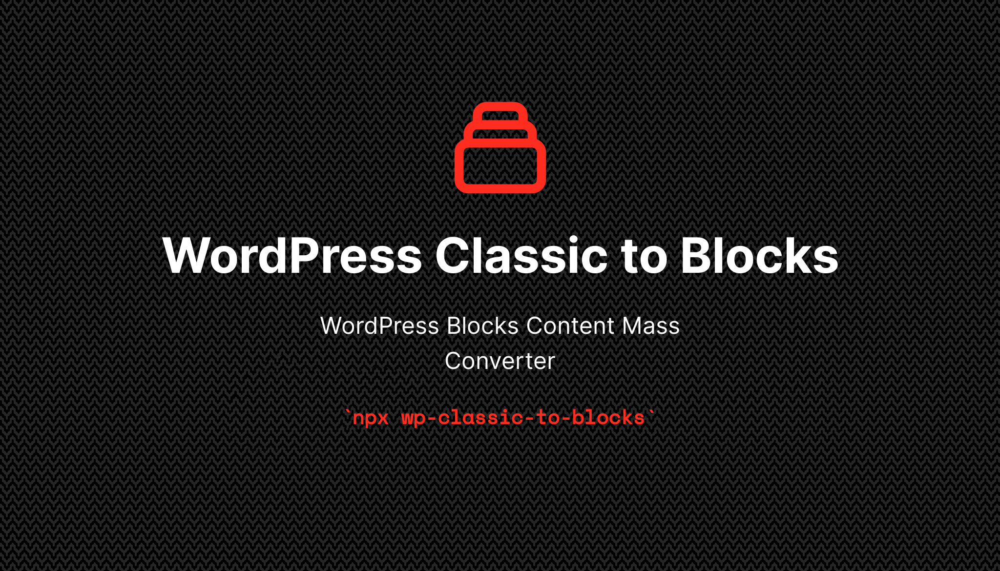

# 

## About

Bulk/Mass convert [Classic Editor](https://wordpress.org/plugins/classic-editor/)
WordPress post to [Blocks Editor](https://wordpress.org/support/article/wordpress-editor/)
posts while keeping database sanity.

The goal is to covert thousands of posts with a minimal impact on the database,
and an under-control impact on the hosting server ressources.
No additional row will be set, only `post_content` cell for all non-null classic
published posts will be updated.

## Note

This tool is targeting power users or admin who want to reduce database
alterations at the minimum while converting old posts to WordPress Blocks posts.  
After last validation, changes are not reversible (not to say destructive).

If a more user-friendly with a graphical interface is wanted (and is more
important than database sanity), please have a look at the
[Bulk Block Converter plugin](https://wordpress.org/plugins/bulk-block-converter/).

**As always, backup your database before.**

## Usage

### Prerequisites

* Install the [Basic Authentication handler plugin](https://github.com/WP-API/Basic-Auth)
  * See [why in the FAQ](#why-the-basic-auth-plugin-is-required)

### CLI

* Download runner
  * Docker image
    ```shell
    docker run ghcr.io/leocolomb/wp-classic-to-blocks
    ```
  * NPM package
    ```shell
    npx wp-classic-to-blocks
    ```

1. Database information will be asked
  * Host
  * Database name
  * Username
  * Password
  * WordPress Table Prefix
2. WordPress REST-API information will be asked
  * Base URL (e.g. `https://my-wp.domain`)
  * Optional IP address to bypass DNS resolution
  * Optional insecure certificate validation
3. Precessing confirmation will be asked

### API

#### registerDatabase(connection, options?)

Returns a promise for generating database interface.

##### connection

Type: `Object`

[Database connection information](https://knexjs.org/#Installation-client).

##### prefix

Type: `String`<br>
Default: `wp_`

Database tables prefix.

#### registerWordPressAPI(options)

Returns a promise for generating WordPress REST-API interface.

##### options

Type: `Object`

###### baseUrl

Type: `String`

Base URL to the WordPress site.

###### username

Type: `String`

Username to connect to the API.

###### password

Type: `String`

Password to connect to the API.

###### ip

Type: `String?`<br>
Default: `null`

IPv4 address to resolve the domain name provided in the base URL.

###### insecure

Type: `Boolean`<br>
Default: `false`

Disable certificate validation.

###### options

Type: `Object`<br>
Default: `{}`

[Additional `got` options](https://github.com/sindresorhus/got#goturl-options).

#### registerBlocksHandler(options)

Returns a promise for generating a classic to block content raw-handler.

## FAQ

### Why use Node.js environment? Why not PHP?

Since [WordPress Blocks environment](https://github.com/WordPress/gutenberg) is
written in JavaScript and targets browsers, the best server-side emulation is Node.js.

### Why browser polyfills are loaded?

The [only way to register blocks](https://github.com/WordPress/gutenberg/tree/master/packages/block-library)
used for conversion uses [`matchMedia`](https://developer.mozilla.org/docs/Web/API/Window/matchMedia)
function, which is not available on Node.js environment, as expected.

### Why WordPress REST-API usage is required?

In order to let the [WordPress Blocks raw handler](https://github.com/WordPress/gutenberg/tree/master/packages/blocks#rawHandler)
handle the post content, the data provided has to be HTML rendered using
[`the_content` filter](https://developer.wordpress.org/reference/hooks/the_content/)
under `edit` (editor) context.

### Why the Basic Auth plugin is required?

Since [WordPress REST-API](https://developer.wordpress.org/rest-api/) does not
support authentification ([seriously](https://developer.wordpress.org/rest-api/using-the-rest-api/authentication/)),
we need to the non-official official authentification public to get rendered
content.

### Why is this so complicated?

WordPress makes things complicated for developers, sometimes.
And https://github.com/WordPress/gutenberg/issues/12694.

## License

ISC © [Léo Colombaro](https://colombaro.fr)
